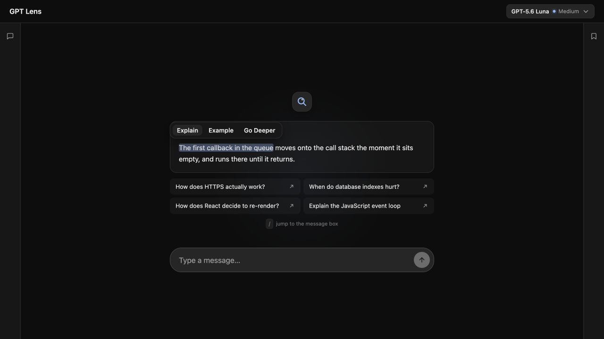
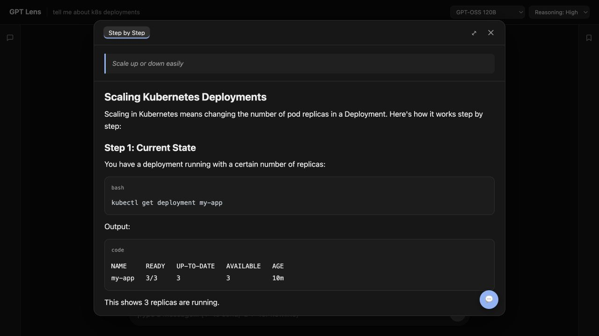

# GPT Lens

GPT Lens is an AI chat app designed for learning and exploring answers in depth.

Its main feature is simple: highlight any part of an AI response, then ask GPT Lens to explain it, give an example, show code, break it into steps, or go deeper. The new explanation opens separately, so you can explore without losing your original conversation.



## What you can do

- Chat with a choice of AI models through OpenRouter.
- Highlight a sentence or paragraph and choose **Explain**, **Example**, **Go Deeper**, **Step by Step**, **Code**, or **What?**
- Write your own instruction for selected text.
- Highlight text inside an explanation to keep drilling down.
- Move between earlier explanations without losing your place.
- Ask follow-up questions inside an explanation.
- Save chats and drill-down sessions automatically on your computer.
- Render Markdown, tables, and syntax-highlighted code.
- Optionally import a webpage or supported AI conversation with the Chrome extension.



## Before you start

You need:

1. **Node.js 20 or newer.** Download the LTS version from [nodejs.org](https://nodejs.org/) if it is not already installed.
2. **An OpenRouter account and API key.** Create one at [openrouter.ai](https://openrouter.ai/). OpenRouter may charge for model usage depending on the model you select.
3. **A copy of this repository** on your computer.

To check whether Node.js is installed, open Terminal (macOS/Linux) or PowerShell (Windows) and run:

```bash
node --version
```

If the displayed version starts with `v20` or a higher number, you are ready.

## Install GPT Lens

Open a terminal in the GPT Lens folder, then run:

```bash
npm run install:all
```

This installs the app, server, and optional browser-extension packages. It may take a few minutes the first time.

## Add your OpenRouter API key

GPT Lens needs your key to send requests to the selected AI model.

### macOS or Linux

```bash
cp server/.env.example server/.env
```

### Windows PowerShell

```powershell
Copy-Item server/.env.example server/.env
```

Open `server/.env` in a text editor. Find this line:

```dotenv
OPENROUTER_API_KEY=your_key_here
```

Replace `your_key_here` with your OpenRouter key, then save the file:

```dotenv
OPENROUTER_API_KEY=sk-or-v1-your-real-key
```

Do not share this file or commit it to Git. The repository is already configured to ignore it.

## Start the app

Run:

```bash
npm run dev
```

Keep that terminal window open while using GPT Lens. When both parts of the app are ready, open:

[http://localhost:5173](http://localhost:5173)

To stop GPT Lens, return to the terminal and press `Ctrl+C`.

## How to use GPT Lens

1. Type a question into the message box and press Enter.
2. Wait for the response to finish, or read it while it streams.
3. Highlight text you want to understand better.
4. Choose an action from the popup, or type your own instruction.
5. Read the explanation in the drill-down window.
6. Highlight text inside that explanation to create another drill-down tab.
7. Use the saved chats on the left and saved sessions on the right to revisit earlier work.

The model and reasoning controls are in the top-right corner. More capable models may produce better answers but can cost more or respond more slowly. Prices shown in the app are OpenRouter estimates per million input and output tokens.

## Optional Chrome extension

The extension can send the page you are viewing into GPT Lens as source material. GPT Lens must already be running at `http://localhost:5173`.

First build the extension:

```bash
npm run build:extension
```

Then install it in Chrome:

1. Open `chrome://extensions`.
2. Turn on **Developer mode** in the top-right corner.
3. Click **Load unpacked**.
4. Select the `extension/dist` folder inside this repository.
5. Pin GPT Lens from Chrome's Extensions menu if you want easy access.

Open a webpage and click the GPT Lens extension icon. The extension will open or focus the local app and import supported page content.

## Where your data goes

- Your OpenRouter API key stays in the local server environment file and is not sent to the browser.
- Chats, messages, saved sessions, and app settings are stored locally in `server/data/gpt-lens.db`.
- Your prompts and the context needed for an answer are sent to OpenRouter and the model you select.
- Deleting `server/data/gpt-lens.db` removes locally saved GPT Lens history and settings. Only do this while the app is stopped and only if you are comfortable losing that data.

## Common problems

### `npm` or `node` is not recognized

Install the current Node.js LTS release from [nodejs.org](https://nodejs.org/), close and reopen your terminal, then try again.

### The app opens but responses fail

Check that:

- `server/.env` exists.
- `OPENROUTER_API_KEY` contains your real key, with no quotes or extra spaces.
- Your OpenRouter account has access or credit for the selected model.
- The terminal running GPT Lens does not show an error.

After changing `server/.env`, stop the app with `Ctrl+C` and run `npm run dev` again.

### Port 5173 or 3001 is already in use

Another copy of GPT Lens—or another development app—may already be running. Close the other terminal process and restart GPT Lens.

### The browser extension does nothing

Make sure:

- GPT Lens is running at `http://localhost:5173`.
- You selected `extension/dist`, not the `extension` source folder.
- You rebuilt and reloaded the extension after changing its source files.
- The current page allows extension access. Chrome internal pages such as `chrome://settings` cannot be imported.

### I changed the default model, but the app still uses my previous choice

The model selected in the app is saved locally. Use the model menu in the top-right corner to change it. Environment defaults mainly apply when the local database is first created.

## Optional advanced settings

Most users only need to set `OPENROUTER_API_KEY`. The remaining values in `server/.env` can usually stay unchanged.

```dotenv
PORT=3001
OPENROUTER_MODEL=openai/gpt-oss-120b
OPENROUTER_MAX_TOKENS=8192
OPENROUTER_REASONING=high
OPENROUTER_BASE_URL=https://openrouter.ai/api/v1
EXTRA_CONTEXT=true
```

- `PORT` changes the local server port.
- `OPENROUTER_MODEL` selects the initial model for a fresh database.
- `OPENROUTER_MAX_TOKENS` limits the maximum generated response length.
- `OPENROUTER_REASONING` selects the initial reasoning level.
- `OPENROUTER_BASE_URL` changes the compatible API endpoint.
- `EXTRA_CONTEXT=true` gives drill-down requests the main conversation and their ancestor explanations. This usually improves continuity but can use more input tokens.

## Useful commands

```bash
npm run dev              # start GPT Lens
npm run dev:server       # start only the local server
npm run dev:client       # start only the web interface
npm run build:extension  # rebuild the Chrome extension
```

GPT Lens is currently intended to run locally on a desktop computer.
